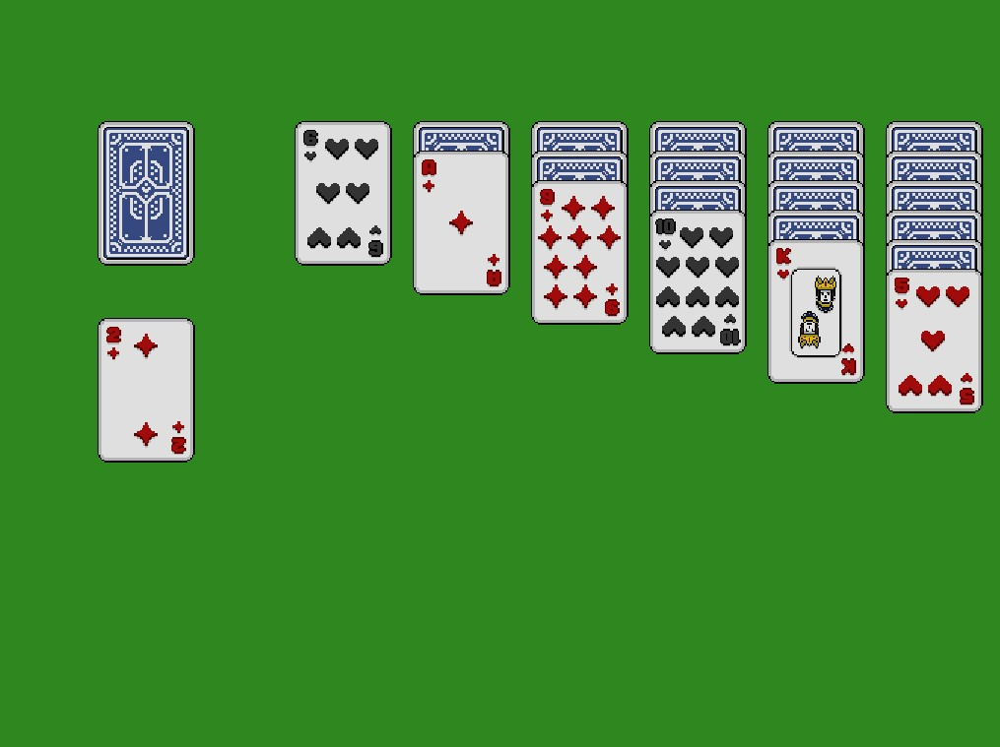
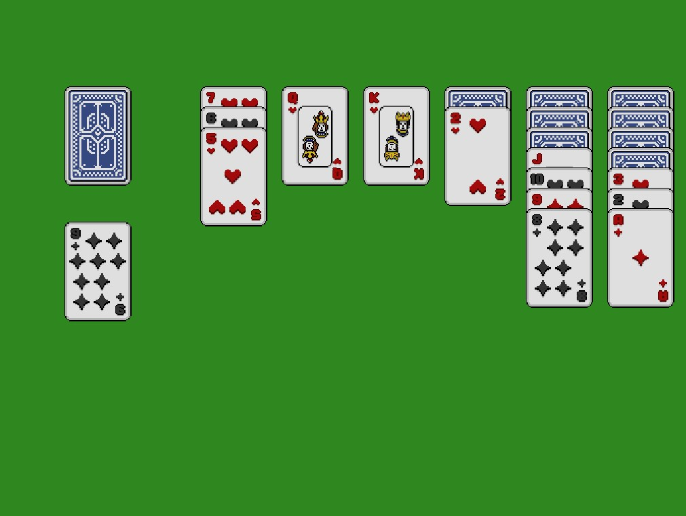

# Solitaire Game in Godot 4

A simple solitaire game built using the Godot game engine. This project serves as a tutorial or base for building solitaire-like card games in Godot.

The game is designed as part of a YouTube tutorial. Check out the complete video in my [YouTube channel](https://www.youtube.com/@TheWizardCoder).

## Highlights

- Drag-and-drop mechanics: Click and drag cards to move them around the board.
- Stock pile system: Draw cards from the stock pile.
- Basic solitaire rules: Organize cards into piles according to the solitaire game rules.
- Easy to customize: Extend the game with more features and custom rules

## Screenshots

## Credits:

- Card Sprites [yuidust/deck-of-cards](https://yuidust.itch.io/deck-of-cards)

## License

This project is licensed under the MIT License. See the [LICENSE](./LICENSE) file for details.